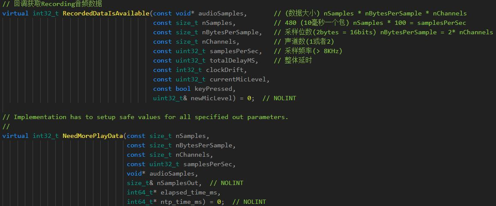

## Webrtc音频采集和播放

### 一：音频采集和播放

音频的采集和播放使用模块**AudioDeviceModule**，定义在modules/audio_device中

[AudioDeviceModule](https://github.com/feixiao/webrtc/tree/master/webrtc_example/AudioDeviceModule) 使用**AudioDeviceModule**采集和播放音频的例子。

使用**AudioDeviceModule**需要实现AudioTransport接口，接口主要是获取采集的音频数据和播放音频数据，主要实现如下：

获取和播放音频数据




注：webrtc提供了**CreateAudioDeviceWithDataObserver**方法，对上述逻辑的封装，可以更方便的使用**AudioDeviceModule**。

### 二: Webrtc对**AudioDeviceModule**的使用

webrtc使用AudioDeviceModule是通过**AudioTransportImpl**进行的。

```c++
class AudioTransportImpl : public AudioTransport
```

通过构造函数和RecordedDataIsAvailable的实现，我们可以得知AudioTransportImpl对采集的音频数据进行了混音和预处理操作，然后**webrtc::AudioSendStream** 进行处理音频数据(这边类型AudioTransportImpl对音频数据进行了分发）。

```c++
// AudioMixer混音
// AudioProcessing音频数据预处理
AudioTransportImpl(AudioMixer* mixer,
                     AudioProcessing* audio_processing);

// RecordedDataIsAvailable中部分实现
if (!sending_streams_.empty()) {
    auto it = sending_streams_.begin();
    while (++it != sending_streams_.end()) {
        std::unique_ptr<AudioFrame> audio_frame_copy(new AudioFrame());
        audio_frame_copy->CopyFrom(*audio_frame.get());
        // 分发音频数据
        (*it)->SendAudioData(std::move(audio_frame_copy));
    }
    // Send the original frame to the first stream w/o copying.
    (*sending_streams_.begin())->SendAudioData(std::move(audio_frame));
}

// 解码 audio/audio_send_stream.cc
void AudioSendStream::SendAudioData(std::unique_ptr<AudioFrame> audio_frame) {
  RTC_CHECK_RUNS_SERIALIZED(&audio_capture_race_checker_);
  // 编码数据
  channel_proxy_->ProcessAndEncodeAudio(std::move(audio_frame));
}

```

